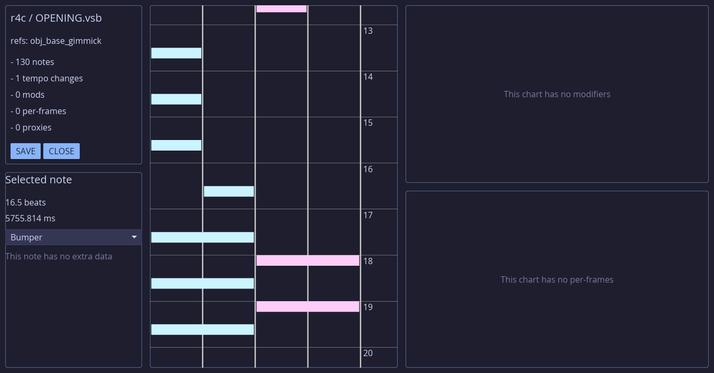

# ChartEd
A vivid/stasis chart editor

Sister project to [vsml](https://github.com/raineycat/vsml)

Features:
- Load and save VSB files
- Create/edit/delete notes
- Create/edit/delete modifiers
- View chart info
- Play back audio

Coming soon:
- Per-frame editing
- Chart-specific modifiers

